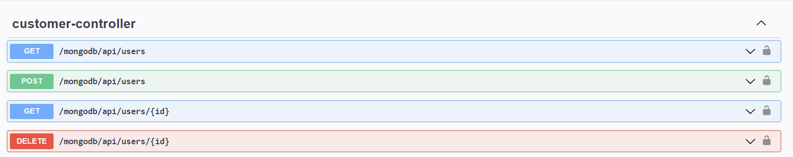
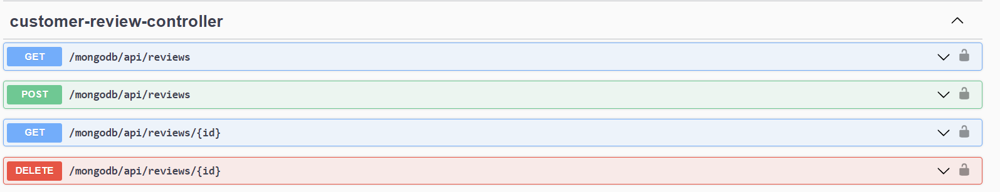
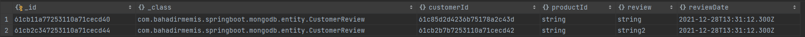
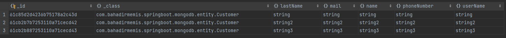

# Ödev 1 

## İçerikler
* [Ekran Görüntüleri](#ekran-görüntüleri)
* [Kullanım](#kullanım)
* [Proje Durumu](#proje-durumu)

## Ekran Görüntüleri

<!-- If you have screenshots you'd like to share, include them here. -->

## Kullanım

`Öncelikle resources klasöründeki application.properties deki konfigürasyonlar( şifre ve kullanıcı adı) özelleştirilmelidir.`

`Daha sonra SpringBootTrainingApplication çalıştırılmalıdır.`

`Daha sonra Swagger ( http://localhost:8080/swagger-ui.html ) üzerinde customer ve customer-review'ın kontrolü yapılabilir.`

## Proje Durumu
Project is: _complete_

